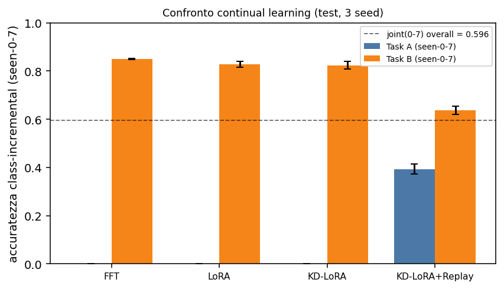
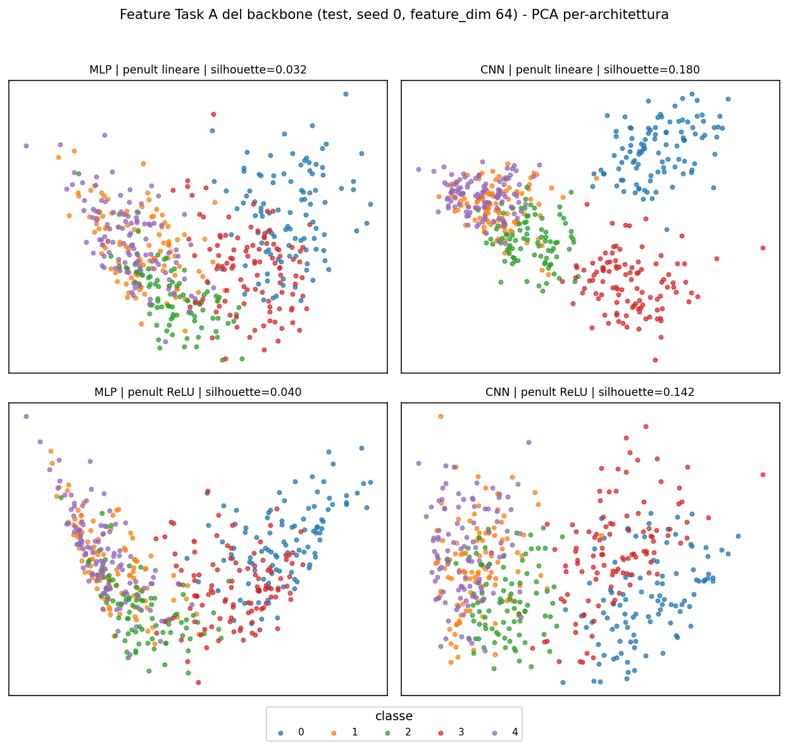
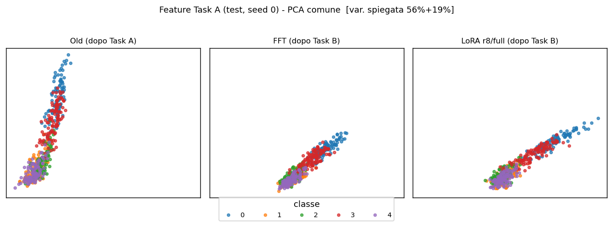
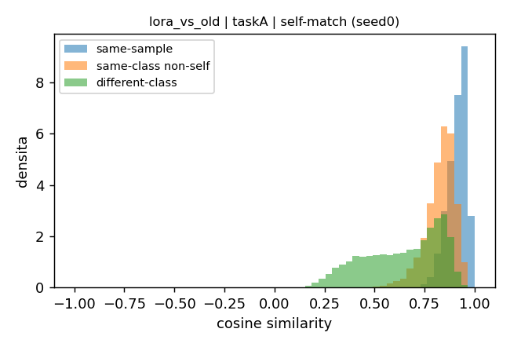
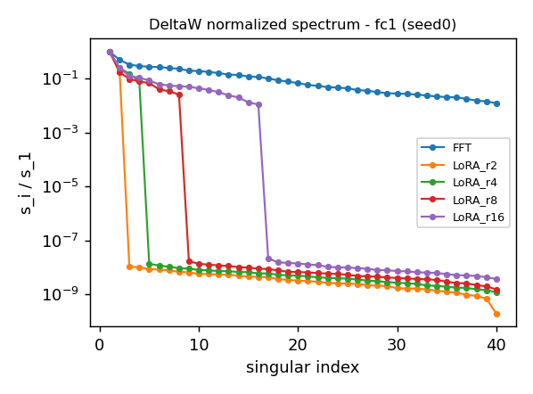
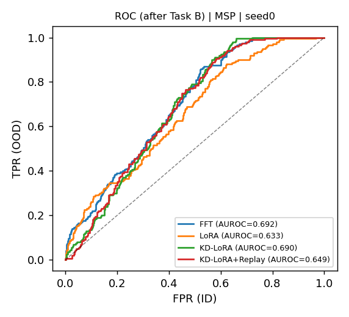

# LoRA for Continual Learning on MNIST-1D

Study of **class-incremental continual learning** on the [MNIST-1D](https://github.com/greydanus/mnist1d)
dataset. A model learns **Task A (classes 0–4)** first and **Task B (classes 5–7)** afterwards, with a
shared 10-way head and **labels never remapped**; **classes 8–9** are held out and used only as
**near-OOD**. We compare **Full Fine-Tuning (FFT)**, **LoRA**, **Replay** and **Knowledge
Distillation (KD)**, and analyse not only accuracy but also feature geometry, representation
compatibility, the spectral structure of the weight updates and OOD behaviour. A small **1D CNN** is
compared against the MLP to isolate the effect of the architectural inductive bias.

All final results are on **3 seeds** (mean ± std, test split); the values reported below are taken
directly from the experiment outputs.

---

## 1. Objectives

- **Catastrophic forgetting**: does sequential training on Task B destroy Task A?
- **Stability–plasticity trade-off**: how much old-task retention costs in new-task plasticity.
- **Representation compatibility**: are the updated features still usable against the old model
  (query-gallery / backward-compatible retrieval)?
- **Effect of the architecture**: MLP vs 1D CNN on accuracy and feature separability.
- **Feature analysis**: PCA, separation metrics (silhouette, nearest-centroid), CKA.
- **OOD detection**: can the model separate the unseen classes 8–9 from the seen ones?

The central finding is a **dissociation between structural stability and decision preservation**:
similar global geometry (CKA), more aligned updates or better-separated features do **not** translate
into better accuracy on the old task, which in the sequential regime is dominated by the **bias of the
shared classification head**.

## 2. Architectures

- **Main MLP `(h1, h2) = (128, 64)`** — `40 → fc1(128) → ReLU → fc2(64) → ReLU → head(10)`; the
  *feature* is the input of the head (output of `fc2`). Selected on the Task A validation split
  (smallest config within 1% of the best; 14 154 parameters). LoRA is applied to `fc1` and `fc2`.
- **Low-dimensional MLPs** — capacity study `(9,9)`, `(64,8)`, `(128,64)`, `(256,256)` (LoRA rank 8,
  full head, linear penultimate) for the interpretable feature/geometry analysis.
- **1D CNN** — `Conv1D → pooling → proj(d) → head(10)`; LoRA is applied to the linear projection
  `proj` only (convolutions frozen), the direct analogue of the MLP setup.

## 3. Methods

- **Full Fine-Tuning (FFT)** — all weights trainable on Task B (maximum plasticity baseline).
- **LoRA** — frozen backbone `W`, low-rank update `ΔW = (α/r)·BA` with `B` zero-initialised
  (`ΔW = 0` at init); rank `r ∈ {2,4,8,16}`, scaling `α = 2r`; head modes `frozen / full / partial`.
- **Knowledge Distillation (KD)** — frozen Task A teacher; `L = L_CE + λ_KD·L_KD` distilling the old
  classes 0–4 on Task B inputs (Learning-without-Forgetting scheme), `T = 2`, `λ_KD = 2`.
- **Replay** — small fixed balanced buffer of Task A examples (`{20, 50, 100}` per class) mixed into
  the Task B batches, with CE and KD applied on the replayed samples.

## 4. Experiments

- Task A → Task B **continual learning** (FFT, LoRA grid, KD-LoRA, KD-LoRA+Replay).
- **Architecture comparison** MLP vs 1D CNN (accuracy, separation, forgetting, compatibility).
- **Low-dimensional / capacity** feature analysis (3 seeds).
- **PCA** and representation metrics (silhouette, nearest-centroid, feature drift).
- **CKA** (linear Centered Kernel Alignment) between updated model and backbone.
- **Compatible learning** via a **query-gallery** protocol (self-match and leave-one-out).
- **SVD** of the weight updates (spectrum, energy, subspace overlap FFT vs LoRA).
- **OOD detection** on classes 8–9 (MSP, MaxLogit, Entropy, Energy scores; AUROC/AUPR).

## 5. Main results

Class-incremental comparison (test, mean ± std over 3 seeds). The **primary metric is `seen-0-7`**
(argmax restricted to the trained classes); `accA masked` (argmax over 0–4) is diagnostic.
References: joint(0–7) upper bound = `0.596 ± 0.01`; Task A backbone (masked) = `0.639 ± 0.02`.

| Method | accA masked | accA (seen-0-7) | forgetting | accB (seen-0-7) | overall (seen-0-7) |
|---|---|---|---|---|---|
| Full Fine-Tuning       | 0.445 ± 0.03 | **0.000** | 0.639 | 0.850 ± 0.00 | 0.311 ± 0.00 |
| LoRA (r8, full head)   | 0.422 ± 0.01 | **0.000** | 0.639 | 0.827 ± 0.01 | 0.303 ± 0.01 |
| KD-LoRA (r8, partial)  | 0.606 ± 0.05 | **0.000** | 0.639 | 0.824 ± 0.02 | 0.302 ± 0.01 |
| KD-LoRA + Replay (100/cls) | 0.644 ± 0.02 | **0.393 ± 0.02** | 0.246 ± 0.01 | 0.637 ± 0.02 | 0.482 ± 0.01 |

Key qualitative findings (consistent across the 3 seeds):

- **Full Fine-Tuning suffers severe catastrophic forgetting**: Task A `seen-0-7` accuracy drops to
  `0.000` (full forgetting, equal to the whole initial backbone accuracy `0.639`).
- The failure is dominated by the **classification-head bias**: the Task A *masked* accuracy stays
  well above zero (up to `0.606` with KD), so the representations are largely preserved while the
  shared head reassigns old samples to the new classes 5–7.
- **KD preserves the representations** (masked ↑) but not the decisions (`seen-0-7` still `0.000`).
- **Replay is the most effective method** at reducing forgetting: it is the only intervention that
  consistently recovers Task A `seen-0-7` accuracy (`0.393` with 100 examples/class), at a clear cost
  in Task B plasticity (a stability–plasticity trade-off).
- **The 1D CNN yields more separable features than the MLP with fewer parameters** (config fd64/ReLU,
  Task A backbone): masked accuracy `0.639 → 0.769`, silhouette `0.039 → 0.152`, nearest-centroid
  accuracy `0.600 → 0.710`, with **7 530** vs **14 154** parameters — but it does **not** remove the
  sequential forgetting.
- **LoRA’s query-gallery compatibility is higher than FFT’s at the instance level**: same-sample
  Top-1 `0.709 ± 0.08` vs `0.383 ± 0.10`. At the class level (leave-one-out) the two are equivalent
  (`≈ 0.60`), so the advantage concerns the *identity of the single sample*, not class structure.
- **SVD** shows LoRA modifies the model within a **low-rank subspace** (numerical rank = `r` by
  construction), with a low top-`r` subspace overlap with FFT on `fc1` (`≈ 0.33`): the two methods
  update the weights in structurally different directions.
- **Classes 8–9 are used only for near-OOD evaluation**: the separation is modest (best AUROC
  `≈ 0.69` with MSP), FFT and KD-LoRA are equivalent, and OOD quality is uncorrelated with retention.

## 6. Figures

**Catastrophic forgetting — main comparison.** Class-incremental `seen-0-7` accuracy: Task A (blue)
collapses to 0 for FFT, LoRA and KD-LoRA; only KD-LoRA+Replay recovers it (to ≈ 0.39).



**Architecture — MLP vs CNN.** PCA of Task A features: the CNN forms clearly more separated class
clusters than the MLP, with fewer parameters.



**PCA of the features (Old / FFT / LoRA).** Common PCA of the Task A features before and after Task B:
after Task B the geometry is compressed and reorganised by both methods.



**Query-gallery compatibility (LoRA vs Old).** Cosine-similarity distributions (same-sample,
same-class non-self, different-class): LoRA shifts all similarities to the right (better instance
alignment) while the class margin stays comparable to FFT.



**SVD spectrum of the `fc1` update.** Normalised singular values (log scale): FFT has a full,
gradually decaying spectrum, LoRA exactly `r` significant values followed by a sharp drop.



**OOD ROC (near-OOD 8–9, MSP).** The ROC curve stays close to the diagonal, consistent with the
modest separation (AUROC ≈ 0.69).



## 7. Repository structure

```
lora-continual-learning-mnist1d/
├── README.md
├── requirements.txt
├── pyproject.toml
├── .gitignore
├── configs/
│   ├── selected_config.json        # standard MLP (128,64) chosen on Task A validation
│   └── preview_methods.json
├── src/mnist1d_cl/
│   ├── constants.py                # INPUT_DIM=40, task/OOD class partition, dataset URL
│   ├── data/                       # download (+ SHA256), split, stable sample IDs, normalizer
│   ├── models/                     # MLP, CNN, feature extraction
│   ├── training/                   # trainer (fit/eval, val checkpointing, early stop, grad clip)
│   ├── lora/                       # LoRALinear, injection, head modes, invariant checks
│   ├── losses/                     # knowledge distillation (KL teacher‖student)
│   ├── replay/                     # balanced fixed replay buffer
│   ├── metrics/                    # masked / seen-0-7 accuracy, forgetting, distributions
│   ├── querygallery/               # cosine retrieval, self-match / leave-one-out, audit
│   ├── svd/                        # SVD of the updates, spectra, subspace overlap
│   ├── represent/                  # separation metrics, PCA, CKA / Procrustes
│   ├── ood/                        # OOD scores + AUROC/AUPR/FPR95
│   ├── plotting/                   # figure helpers
│   ├── utils/                      # seed, device, IO, provenance
│   └── experiments/                # runnable entry points (see §9)
├── tests/                          # pytest suite (shapes, LoRA invariants, metrics, OOD, SVD, ...)
└── assets/figures/                 # figures used in this README
```

## 8. Installation

```bash
git clone https://github.com/biondiLeo/lora-continual-learning-mnist1d.git
cd lora-continual-learning-mnist1d
pip install -r requirements.txt
pip install -e . --no-deps      # makes the `mnist1d_cl` package importable
```

For a CUDA build of PyTorch, install `torch` from <https://download.pytorch.org/whl/cu121> instead of
the plain wheel. The MNIST-1D dataset is **downloaded automatically** (with an SHA256 check) into
`data/` on the first run — no manual download step is required.

## 9. Running the experiments

Every experiment is a module run with `python -m mnist1d_cl.experiments.<name>`. Common flags:
`--seeds 0 1 2`, `--data-dir data`, `--out outputs`, `--device cpu|cuda`.

```bash
# Preliminary config selection on validation (never on test)
python -m mnist1d_cl.experiments.select_config

# End-to-end smoke test (tiny training + all invariant checks)
python -m mnist1d_cl.experiments.smoke

# Sequential continual learning, Exp0–4 (joint, FFT, LoRA grid, KD-LoRA, KD-LoRA+Replay)
python -m mnist1d_cl.experiments.run_sequential --seeds 0 1 2

# Representation compatibility (query-gallery)
python -m mnist1d_cl.experiments.exp5_compat --seeds 0 1 2

# OOD detection on classes 8–9
python -m mnist1d_cl.experiments.exp6_ood --seeds 0 1 2

# SVD analysis of the weight updates
python -m mnist1d_cl.experiments.exp7_svd --seeds 0 1 2

# Architecture comparison MLP vs 1D CNN
python -m mnist1d_cl.experiments.exp_cnn_vs_mlp --seeds 0 1 2

# Low-dimensional / capacity study (multi-seed)
python -m mnist1d_cl.experiments.exp_lowdim_multiseed --seeds 0 1 2

# Test suite
python -m pytest
```

Individual experiments `exp0_joint`, `exp1_fft`, `exp2_lora`, `exp3_kdlora`, `exp4_replay` can also be
run standalone. Results are written under `outputs/<experiment>/...` (git-ignored).

## 10. Reproducibility

- **Seeds**: all main results use seeds `0, 1, 2`; the Task A backbone is trained **once per seed** and
  every Task B method starts from that **same checkpoint** (fair comparison).
- **Validation-only selection**: checkpoints and hyperparameters are chosen on a stratified validation
  split (~15%, fixed `data_seed = 1234`, shared across methods/seeds). The **test set is frozen** and
  never used for any selection.
- **No leakage**: per-feature normalisation is fit **only on the Task A train split**, then frozen and
  reused on Task B / validation / test / OOD.
- **Stable sample IDs** (`train_XXXX` / `test_XXXX`) are used for the query-gallery analysis.
- Final metrics are reported as **mean ± std over the 3 seeds**.

## 11. Key references

- **LoRA** — Hu et al., *LoRA: Low-Rank Adaptation of Large Language Models*, ICLR 2022.
  [arXiv:2106.09685](https://arxiv.org/abs/2106.09685)
- **Backward-compatible / compatible learning** — Shen et al., *Towards Backward-Compatible
  Representation Learning*, CVPR 2020.
  [paper](https://openaccess.thecvf.com/content_CVPR_2020/html/Shen_Towards_Backward-Compatible_Representation_Learning_CVPR_2020_paper.html)
- **CKA** — Kornblith et al., *Similarity of Neural Network Representations Revisited*, ICML 2019.
  [arXiv:1905.00414](https://arxiv.org/abs/1905.00414)
- **MSP (OOD baseline)** — Hendrycks & Gimpel, *A Baseline for Detecting Misclassified and
  Out-of-Distribution Examples in Neural Networks*, ICLR 2017.
  [arXiv:1610.02136](https://arxiv.org/abs/1610.02136)
- **Energy-based OOD** — Liu et al., *Energy-based Out-of-distribution Detection*, NeurIPS 2020.
  [arXiv:2010.03759](https://arxiv.org/abs/2010.03759)
- **MNIST-1D** — Greydanus & Kobak, *Scaling Down Deep Learning with MNIST-1D*, ICML 2024.
  [repo](https://github.com/greydanus/mnist1d)
